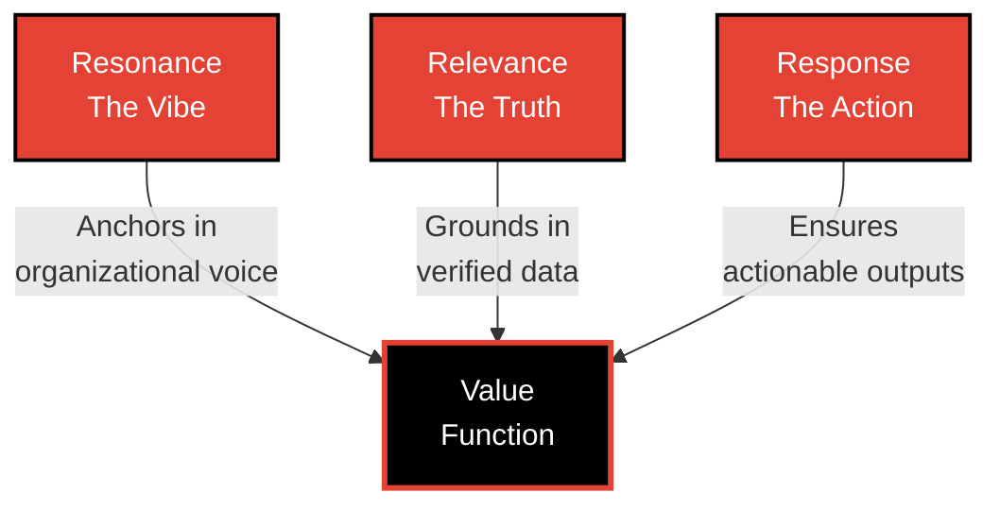

# 🔴 Siddhartha Chaturvedi

### **Post-Agentic Systems** • AI that acts, not just answers

---

## 💭 Philosophy

> **"Strategy without execution is hallucination.  
> Execution without strategy is chaos."**  
> — *Overheard at INSEAD*

---

## 👤 About

### 🌍 Previous Chapter: **Planetary Scale**
**Director of Product Management**

Directed the intersection of AI and Global Security. From tracking pathogens with **Premonition** to deploying Gen AI systems - from LLMs to Agents - for the **US Federal Government (Civilian)**. 300+ use cases.

### 🎯 Current Focus: **Precision Truth**
**Under-represented Disease Research**

Decoupling intelligence from human bottlenecks. Solving data swamps in scientific research, starting with the underserved landscape of **Endometriosis**. Evidence-grade. Autonomous.

---

## 🧮 The Value Function

**Resonance + Relevance + Response**

> *Alignment is a three-body problem. Truth without voice feels robotic. Voice without truth hallucinates. Both without utility waste compute.*

| Component | Definition | Example |
|-----------|-----------|---------|
| **Resonance** | Anchors the model in organizational voice and brand aesthetics to prevent generic, robotic outputs | A healthcare AI that speaks with clinical precision while maintaining patient-centered warmth |
| **Relevance** | Grounds responses in proprietary knowledge and verified data sources to eliminate hallucination | Research synthesis that cites only peer-reviewed sources from your institutional database |
| **Response** | Ensures outputs are actionable, deterministic, and directly useful to the end user's workflow | Generating structured clinical protocols, not just answering questions about treatment options |

---

## 🎯 Core Themes

🔴 **17 YEARS TO ENDOMETRIOSIS DIAGNOSIS IS UNACCEPTABLE**  
🔴 **SCIENCE MOVES AT THE SPEED OF TRUST, NOT COMPUTE**  
🔴 **INFORMATION AS THERAPY**  
🔴 **INTERDEPENDENCE OVER INDEPENDENCE**  
🔴 **BREAKING INTERGENERATIONAL DISADVANTAGE**  
🔴 **SUCCESS GIVES NAME, FAILURE WISDOM**

---

## 🏆 Recognition

### 2021 • Fast Company's World Changing Idea
**Microsoft Premonition**: A biothreat detection platform securing multi-million government contracts. Early warning systems for disease outbreaks.

🔗 [Read More](https://www.fastcompany.com/section/premonition)

### 2020 • AI for Health: $60M Impact Investment
Architected a global program addressing the barriers I faced as a first-time founder in rural India. Tackling child mortality, infectious disease, and health equity through accessible AI.

🔗 [Read More](https://blogs.microsoft.com/on-the-issues/2020/01/29/ai-for-health-child-mortality/)

---

## 💬 Peer Review

> ### The Technologist
> *"Technical depth leading to incredible storytelling agility. Nuanced stories grounded in science truth."*  
> **— Ethan Jackson**, Senior Director

> ### The Humanist
> *"Understanding complex problems and finding an easy way to explain in lay terms. Cares for what is good for society."*  
> **— Juan Lavista Ferres**, Corporate Vice President

> ### The Strategist
> *"Compelling stories to share vision, shift perception, and accelerate adoption. Envisioning long-term outcomes."*  
> **— Sara Nagy**, Senior Director

---

## 🚀 Ventures

### 🔬 [Veriscience.AI](https://veriscience.ai)
**The Science of Truth**

Evidence-grade AI for women's health. Turning 17-year diagnosis delays into months through autonomous research synthesis.

### 🧊 [Unfreeze.org](https://unfreeze.org)
**Agentic Resilience**

Career transition intelligence. Navigate layoffs and pivots with AI that understands your skills, market gaps, and next moves.

### 📊 [Stratified Advisory](https://stratcorp.ai)
**Risk × Value**

Board-as-a-Service for GenAI era. Strategic governance for founders building in regulated, high-stakes domains.

### ✍️ [JustAI.Fyi](https://justai.fyi)
**Author**

Synthesis of Software 3.0 thinking. Essays on post-agentic systems, reasoning engines, and the infrastructure of truth.

---

## 🔬 Current Investigations

| # | Investigation | Description |
|---|---------------|-------------|
| **01** | **Post-Agentic AI Systems** | Next-generation scientific computing platforms that transcend current agent limitations. Moving from chat to action. |
| **02** | **Scientific Knowledge Graphs** | Reimagining how research connections are discovered and accelerated. Reducing the 18-month lag in global health data. |
| **03** | **Public-Private Innovation** | Healthcare and government partnerships through responsible AI governance and "One Health" approaches. |

---

## 🤝 Connect

### 📍 Advisory & Investment

**Limited Partner**  
rpv (DeepTech VC)

**Advisor**  
Loyal VC

### ✅ Currently Available

- Strategic Advisory
- Keynote Speaking
- Board Positions

---

## 📫 Get in Touch

### Let's Talk.

**Available for global engagements**

---

### Systems of Truth. **Scaled Responsibly**.

*Moving beyond chatbots to reasoning engines. Building the infrastructure for scientific autonomy and equitable truth.*

© MMXXV Siddhartha Chaturvedi

